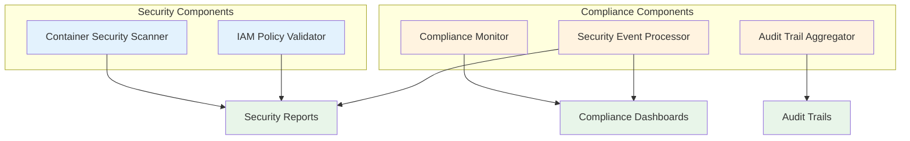

## Proposal Development Overview
> **Note:** This section is included for tracking notebook development progress and will be removed upon final version of the notebook.

| Section | Description | Key Components | Status | Notes | Author |
|---------|-------------|----------------|:------:|-------|--------|
| **1. Introduction and System Requirements** | Problem statement and requirements analysis | • Problem Statement<br>• Requirements Analysis<br>• System Constraints and Considerations | 🟢 | | Chris Trauco |
| **2. Container Security Architecture** | Kubernetes RBAC and cluster security controls, Docker container security and image scanning | • Architecture Considerations<br>• Security Design<br>• Implementation Approach | 🟡  | | |
| **3. Data Security and Storage Framework** | Cloud Storage encryption and access controls, BigQuery data governance and compliance monitoring | • Security Strategy<br>• Compliance Design | 🟡  | | |
| **4. Serverless Security Infrastructure** | Cloud Functions access controls and authentication, Event-driven security monitoring and response | • Architecture Considerations<br>• Security Design<br>• Monitoring Design | 🟡 | | |
| **5. Identity and Access Management Subsystem** | Role-based access control architecture, Privilege management and least-privilege enforcement | • IAM Architecture<br>• RBAC Design<br>• Access Control Strategy | 🟡 | | |
| **6. Monitoring and Observability Framework** | Container and serverless security monitoring, Compliance dashboards and audit reporting | • Container Security Monitoring Design<br>• Serverless Security Monitoring Design<br>• Compliance Dashboard Design<br>• Audit Reporting Design | 🟡 | | |
| **7. Optional Demonstration Components** | Barebones skeleton components for potential post-proposal development | • Container Security Scanner<br>• IAM Policy Validator<br>• Compliance Monitor<br>• Security Event Processor<br>• Audit Trail Aggregator | 🟡 | Illustrative examples only - not proposal deliverables | |
| **8. Key Recommendations** | Strategic guidance and best practices | • Security Architecture<br>• Compliance Strategy | 🟡 | | |

**Status Key:** 🔴 Not Started | 🟡 In Progress | 🟢 Complete

# Healthcare Data Platform Security Architecture System Design Proposal

## 1. Introduction and System Requirements

### 1.1 Problem Statement

A healthcare technology company wants to build a secure data analytics platform using containerized workloads and Cloud Storage for sensitive patient data analysis. They need guidance on:

- Kubernetes security architecture
- Docker container protection  
- Cloud Functions access controls
- BigQuery compliance integration

This represents a fundamental systems challenge requiring coordination of multiple security components while maintaining HIPAA compliance for patient data.

### 1.2 Requirements Analysis

Based on the healthcare technology company's needs, the following requirements have been identified for the secure data analytics platform.

#### Container Security Requirements
- **Kubernetes RBAC**: Implement role-based access control for cluster security
- **Docker Security**: Container image scanning and runtime protection
- **Cluster Controls**: Kubernetes security policies and network segmentation

#### Data Security Requirements
- **Cloud Storage Encryption**: Encryption at rest and in transit for patient data
- **Access Controls**: IAM policies for Cloud Storage buckets
- **BigQuery Governance**: Data access logging and compliance monitoring

#### Serverless Security Requirements
- **Cloud Functions Authentication**: Service account management and API security
- **Event Monitoring**: Security event capture and response automation
- **Access Controls**: Function-level permissions and invocation policies

#### Compliance and Monitoring Requirements
- **HIPAA Adherence**: Patient data protection and audit trails
- **Continuous Monitoring**: Real-time security event detection
- **Compliance Validation**: Automated policy enforcement and reporting

### 1.3 System Constraints and Considerations

#### Technical Constraints
- **Containerized Workloads**: Must support Docker containers and Kubernetes orchestration
- **Cloud Storage Integration**: Sensitive patient data requires specific storage architecture
- **Serverless Requirements**: Cloud Functions must integrate with existing systems
- **BigQuery Compliance**: Analytics platform must maintain compliance during queries

#### Security Constraints
- **HIPAA Compliance**: All components must meet healthcare regulatory requirements
- **Defense-in-Depth**: Multiple layers of security controls required
- **Access Control**: Strict authentication and authorization mechanisms
- **Audit Requirements**: Comprehensive logging and monitoring capabilities

#### Design Considerations
- **Scalability**: System must handle growing patient data volumes
- **Integration**: Components must work within GCP ecosystem
- **Automation**: Governance and compliance checks must be automated
- **Observability**: Security events must be visible and actionable

#### Implementation Considerations
- **Container Security Architecture**: Kubernetes RBAC and Docker security controls
- **Data Security and Storage Framework**: Cloud Storage encryption and BigQuery governance
- **Serverless Security Infrastructure**: Cloud Functions access controls and monitoring
- **Identity and Access Management Subsystem**: RBAC architecture and privilege management
- **Monitoring and Observability Framework**: Security monitoring and compliance reporting


```python
import matplotlib.pyplot as plt
import matplotlib.patches as patches

# security architecture overview
fig, ax = plt.subplots(figsize=(10, 4))

# components
components = [
   'Container\nSecurity', 
   'Data\nSecurity', 
   'Serverless\nSecurity', 
   'IAM\nSubsystem', 
   'Monitoring\nFramework'
]
colors = ['lightcoral', 'lightblue', 'lightgreen', 'lightyellow', 'plum']
y_pos = 3

# draw boxes
for i, (component, color) in enumerate(zip(components, colors)):
   x = i * 2 + 1
   # box
   ax.add_patch(plt.Rectangle((x-0.6, y_pos-0.4), 1.2, 0.8,
                             fill=True, facecolor=color, edgecolor='black'))
   ax.text(x, y_pos, component, ha='center', va='center', fontsize=10)
   
   # arrow
   if i < len(components) - 1:
       ax.arrow(x + 0.65, y_pos, 0.5, 0, head_width=0.15,
               head_length=0.2, fc='gray', ec='gray')

# title
ax.text(5, 4.5, 'Healthcare Security Architecture Components', ha='center', fontsize=14)
ax.set_xlim(0, 10)
ax.set_ylim(0, 5)
ax.axis('off')
plt.tight_layout()
plt.show()
```


    

    


#### Summary

This section has identified the key requirements and constraints for developing a secure healthcare data analytics platform. The main challenges center around:

1. **Security Requirements**: Implementing container security, data protection, and serverless access controls
2. **Compliance Needs**: Ensuring HIPAA compliance across all system components  
3. **System Integration**: Building a systematic GCP-based approach as requested

The subsequent sections will detail the technical architecture and implementation approach to address these requirements within the identified constraints.

## 2. Container Security Architecture

### 2.1 Architecture Considerations

The container security architecture for the healthcare data platform centers on two key components:

#### Kubernetes Security
- **RBAC Implementation**: Role-based access control for cluster resources
- **Cluster Security Controls**: Security policies and controls for the Kubernetes environment

#### Docker Security
- **Container Security**: Protection mechanisms for Docker containers
- **Image Scanning**: Vulnerability detection for container images


```python
import matplotlib.pyplot as plt
import matplotlib.patches as patches

fig, ax = plt.subplots(1, 1, figsize=(10, 6))
ax.set_xlim(0, 10)
ax.set_ylim(0, 10)
ax.axis('off')

# title
ax.text(5, 9, 'Container Security Components', fontsize=18, fontweight='bold', ha='center')

# kubernetes box
k8s = patches.FancyBboxPatch((1, 4), 3.5, 3, boxstyle="round,pad=0.1", 
                            facecolor='#326ce5', edgecolor='navy', linewidth=2)
ax.add_patch(k8s)
ax.text(2.75, 6, 'Kubernetes', fontsize=14, fontweight='bold', ha='center', color='white')
ax.text(2.75, 5.3, 'RBAC', fontsize=12, ha='center', color='white')
ax.text(2.75, 4.7, 'Cluster Security', fontsize=12, ha='center', color='white')

# docker box
docker = patches.FancyBboxPatch((5.5, 4), 3.5, 3, boxstyle="round,pad=0.1", 
                               facecolor='#2496ed', edgecolor='navy', linewidth=2)
ax.add_patch(docker)
ax.text(7.25, 6, 'Docker', fontsize=14, fontweight='bold', ha='center', color='white')
ax.text(7.25, 5.3, 'Container Security', fontsize=12, ha='center', color='white')
ax.text(7.25, 4.7, 'Image Scanning', fontsize=12, ha='center', color='white')

# healthcare data
data = patches.FancyBboxPatch((2.5, 1.5), 5, 1.5, boxstyle="round,pad=0.1", 
                             facecolor='lightgreen', edgecolor='darkgreen', linewidth=2)
ax.add_patch(data)
ax.text(5, 2.2, 'Healthcare Data Platform', fontsize=12, fontweight='bold', ha='center')

# arrows
ax.arrow(2.75, 3.8, 0, -0.5, head_width=0.2, head_length=0.1, fc='gray', ec='gray')
ax.arrow(7.25, 3.8, 0, -0.5, head_width=0.2, head_length=0.1, fc='gray', ec='gray')

plt.tight_layout()
plt.show()
```


    

    


### 2.2 Security Design

#### RBAC Design
- **Access Control Strategy**: Define roles and permissions for healthcare platform users
- **Security Policy Framework**: Establish cluster-wide security controls

#### Container Security Design
- **Docker Security Approach**: Security configurations for container deployment
- **Image Scanning Strategy**: Vulnerability assessment process for container images

### 2.3 Implementation Approach

#### RBAC Implementation
- **Configuration Strategy**: Approach for setting up Kubernetes RBAC
- **Security Control Deployment**: Method for implementing cluster security controls

#### Container Security Implementation
- **Docker Security Deployment**: Approach for implementing container security
- **Image Scanning Integration**: Process for incorporating vulnerability scanning


## 3. Data Security and Storage Framework

### 3.1 Security Strategy

The data security framework for healthcare patient data focuses on two core components:

#### Cloud Storage Security
- **Encryption**: Data encryption at rest and in transit
- **Access Controls**: IAM policies for Cloud Storage buckets

#### BigQuery Security
- **Data Governance**: Access control and data classification
- **Compliance Monitoring**: Audit logging and compliance tracking

### 3.2 Compliance Design

#### Storage Compliance Framework
- **HIPAA-Compliant Storage**: Secure configuration for patient data storage
- **Access Logging**: Comprehensive audit trails for data access

#### Analytics Compliance
- **BigQuery Compliance Controls**: Data governance for analytics queries
- **Monitoring Integration**: Compliance validation and reporting

### 3.3 Implementation Approach

#### Cloud Storage Implementation
- **Encryption Configuration**: Setup for data protection
- **Access Control Deployment**: IAM policy implementation

#### BigQuery Implementation
- **Governance Setup**: Data access and classification configuration
- **Compliance Monitoring**: Audit logging and tracking deployment


```python
import matplotlib.pyplot as plt
import matplotlib.patches as patches

fig, ax = plt.subplots(1, 1, figsize=(10, 6))
ax.set_xlim(0, 10)
ax.set_ylim(0, 10)
ax.axis('off')

# title
ax.text(5, 9, 'Data Security Architecture', fontsize=18, fontweight='bold', ha='center')

# cloud storage box
storage = patches.FancyBboxPatch((0.5, 4), 4, 3, boxstyle="round,pad=0.1", 
                               facecolor='#4285f4', edgecolor='navy', linewidth=2)
ax.add_patch(storage)
ax.text(2.5, 6, 'Cloud Storage', fontsize=14, fontweight='bold', ha='center', color='white')
ax.text(2.5, 5.3, 'Encryption', fontsize=12, ha='center', color='white')
ax.text(2.5, 4.7, 'Access Controls', fontsize=12, ha='center', color='white')

# bigquery box
bigquery = patches.FancyBboxPatch((5.5, 4), 4, 3, boxstyle="round,pad=0.1", 
                                facecolor='#ea4335', edgecolor='darkred', linewidth=2)
ax.add_patch(bigquery)
ax.text(7.5, 6, 'BigQuery', fontsize=14, fontweight='bold', ha='center', color='white')
ax.text(7.5, 5.3, 'Data Governance', fontsize=12, ha='center', color='white')
ax.text(7.5, 4.7, 'Compliance Monitoring', fontsize=12, ha='center', color='white')

# patient data
data = patches.FancyBboxPatch((2.5, 1.5), 5, 1.5, boxstyle="round,pad=0.1", 
                            facecolor='lightcoral', edgecolor='darkred', linewidth=2)
ax.add_patch(data)
ax.text(5, 2.2, 'Patient Data', fontsize=12, fontweight='bold', ha='center')

# arrows
ax.arrow(2.5, 3.8, 0, -0.5, head_width=0.2, head_length=0.1, fc='gray', ec='gray')
ax.arrow(7.5, 3.8, 0, -0.5, head_width=0.2, head_length=0.1, fc='gray', ec='gray')

plt.tight_layout()
plt.show()
```


    

    


#### Summary

This section has outlined the data security and storage framework focusing on:
1. **Cloud Storage**: Encryption and access controls for patient data
2. **BigQuery**: Data governance and compliance monitoring

These components ensure secure storage and compliant analytics for sensitive healthcare data. The next section will address serverless security infrastructure.

## 4. Serverless Security Infrastructure

### 4.1 Architecture Considerations

The serverless security infrastructure for the healthcare platform addresses:

#### Cloud Functions Security
- **Access Controls**: [Cloud Functions](https://cloud.google.com/functions/docs/concepts/iam) authentication mechanisms
- **Authentication**: Service-level security configurations

#### Event-Driven Security
- **Security Monitoring**: Event-driven security monitoring
- **Response**: Automated security event response

### 4.2 Security Design

#### Cloud Functions Design
- **Access Control Framework**: Authentication and authorization design
- **Security Configuration**: Function-level security settings

#### Event Monitoring Design
- **Monitoring Architecture**: Event-driven security monitoring design
- **Response Framework**: Security event response mechanisms

### 4.3 Implementation Approach

#### Cloud Functions Implementation
- **Access Control Setup**: Configuration of authentication and authorization
- **Security Deployment**: Implementation of function security settings

#### Event Monitoring Implementation
- **Monitoring Deployment**: Event-driven security monitoring setup
- **Response Configuration**: Security event response implementation


```python
import matplotlib.pyplot as plt
import matplotlib.patches as patches

fig, ax = plt.subplots(1, 1, figsize=(10, 6))
ax.set_xlim(0, 10)
ax.set_ylim(0, 10)
ax.axis('off')

# title
ax.text(5, 9, 'Serverless Security Components', fontsize=18, fontweight='bold', ha='center')

# cloud functions box
functions = patches.FancyBboxPatch((0.5, 4.5), 4, 2.5, boxstyle="round,pad=0.1", 
                                 facecolor='#34a853', edgecolor='darkgreen', linewidth=2)
ax.add_patch(functions)
ax.text(2.5, 6.2, 'Cloud Functions', fontsize=14, fontweight='bold', ha='center', color='white')
ax.text(2.5, 5.5, 'Access Controls', fontsize=12, ha='center', color='white')
ax.text(2.5, 5, 'Authentication', fontsize=12, ha='center', color='white')

# event monitoring box
events = patches.FancyBboxPatch((5.5, 4.5), 4, 2.5, boxstyle="round,pad=0.1", 
                              facecolor='#fbbc04', edgecolor='darkorange', linewidth=2)
ax.add_patch(events)
ax.text(7.5, 6.2, 'Event-Driven', fontsize=14, fontweight='bold', ha='center', color='white')
ax.text(7.5, 5.5, 'Security Monitoring', fontsize=12, ha='center', color='white')
ax.text(7.5, 5, 'Response', fontsize=12, ha='center', color='white')

# security flow
flow = patches.FancyBboxPatch((2, 2), 6, 1.5, boxstyle="round,pad=0.1", 
                            facecolor='lightblue', edgecolor='darkblue', linewidth=2)
ax.add_patch(flow)
ax.text(5, 2.7, 'Serverless Security Layer', fontsize=12, fontweight='bold', ha='center')

# arrows
ax.arrow(2.5, 4.3, 0, -0.5, head_width=0.2, head_length=0.1, fc='gray', ec='gray')
ax.arrow(7.5, 4.3, 0, -0.5, head_width=0.2, head_length=0.1, fc='gray', ec='gray')

plt.tight_layout()
plt.show()
```


    

    


m#### Summary

This section has outlined the serverless security infrastructure focusing on:
1. **[Cloud Functions](https://cloud.google.com/functions/docs)**: Access controls and authentication
2. **Event-Driven Security**: Monitoring and response mechanisms

These components provide secure serverless computing capabilities for the healthcare platform. The next section will address the identity and access management subsystem.

## 5. Identity and Access Management Subsystem

### 5.1 IAM Architecture

The identity and access management subsystem for the healthcare platform encompasses:

#### Role-Based Access Control
- **RBAC Architecture**: Role-based access control design for [Cloud IAM](https://cloud.google.com/iam/docs)
- **Role Definition**: Healthcare-specific role structures

#### Privilege Management
- **Least-Privilege Enforcement**: Minimal permission assignment
- **Access Control Policies**: Permission boundaries and restrictions

### 5.2 RBAC Design

#### Healthcare Role Design
- **Role Structure**: Roles aligned with healthcare team functions
- **Permission Model**: Access rights based on job responsibilities

#### Access Control Strategy
- **Permission Boundaries**: Defined limits for each role
- **Enforcement Mechanisms**: Automated privilege management

### 5.3 Implementation Approach

#### RBAC Implementation
- **Role Configuration**: Setup of role-based access control
- **Policy Deployment**: Implementation of access policies

#### Privilege Management Implementation
- **Least-Privilege Setup**: Configuration of minimal permissions
- **Enforcement Deployment**: Automated privilege management implementation


```python
import matplotlib.pyplot as plt
import matplotlib.patches as patches

fig, ax = plt.subplots(1, 1, figsize=(10, 6))
ax.set_xlim(0, 10)
ax.set_ylim(0, 10)
ax.axis('off')

# title
ax.text(5, 9, 'IAM Architecture', fontsize=18, fontweight='bold', ha='center')

# rbac box
rbac = patches.FancyBboxPatch((0.5, 4.5), 4, 2.5, boxstyle="round,pad=0.1", 
                             facecolor='#9333ea', edgecolor='darkviolet', linewidth=2)
ax.add_patch(rbac)
ax.text(2.5, 6.2, 'RBAC', fontsize=14, fontweight='bold', ha='center', color='white')
ax.text(2.5, 5.5, 'Role Architecture', fontsize=12, ha='center', color='white')
ax.text(2.5, 5, 'Access Control', fontsize=12, ha='center', color='white')

# privilege box
privilege = patches.FancyBboxPatch((5.5, 4.5), 4, 2.5, boxstyle="round,pad=0.1", 
                                 facecolor='#f59e0b', edgecolor='darkorange', linewidth=2)
ax.add_patch(privilege)
ax.text(7.5, 6.2, 'Privilege Mgmt', fontsize=14, fontweight='bold', ha='center', color='white')
ax.text(7.5, 5.5, 'Least-Privilege', fontsize=12, ha='center', color='white')
ax.text(7.5, 5, 'Enforcement', fontsize=12, ha='center', color='white')

# healthcare users
users = patches.FancyBboxPatch((2, 2), 6, 1.5, boxstyle="round,pad=0.1", 
                             facecolor='lightsteelblue', edgecolor='steelblue', linewidth=2)
ax.add_patch(users)
ax.text(5, 2.7, 'Healthcare Users & Services', fontsize=12, fontweight='bold', ha='center')

# arrows
ax.arrow(2.5, 4.3, 0, -0.5, head_width=0.2, head_length=0.1, fc='gray', ec='gray')
ax.arrow(7.5, 4.3, 0, -0.5, head_width=0.2, head_length=0.1, fc='gray', ec='gray')

plt.tight_layout()
plt.show()
```


    

    


#### Summary

This section has defined the identity and access management subsystem focusing on:
1. **Role-Based Access Control**: Architecture and implementation for [Cloud IAM](https://cloud.google.com/iam/docs)
2. **Privilege Management**: Least-privilege enforcement and access control

These components ensure proper authentication and authorization across the healthcare platform. The next section will address monitoring and observability framework.

## 6. Monitoring and Observability Framework

### 6.1 Container Security Monitoring Design

The monitoring framework for containerized and serverless workloads includes:

#### Container Security Monitoring
- **Security Monitoring**: Container security event tracking
- **Alert Framework**: Security incident detection and notification

#### Serverless Security Monitoring  
- **Function Monitoring**: [Cloud Functions](https://cloud.google.com/functions/docs) security monitoring
- **Event Tracking**: Serverless security event capture

### 6.2 Compliance Dashboard Design

#### Dashboard Components
- **Security Metrics**: Real-time security status visualization
- **Compliance Indicators**: Healthcare regulatory compliance tracking

#### Reporting Framework
- **Automated Reporting**: Scheduled compliance report generation
- **Audit Trail Dashboard**: Centralized audit event visualization

### 6.3 Audit Reporting Design

#### Audit Framework
- **Event Collection**: Comprehensive security event aggregation
- **Compliance Validation**: Automated compliance check reporting

#### Report Generation
- **Security Reports**: Periodic security posture documentation
- **Audit Trail Reports**: Access and activity audit documentation


```python
import matplotlib.pyplot as plt
import matplotlib.patches as patches

fig, ax = plt.subplots(1, 1, figsize=(10, 6))
ax.set_xlim(0, 10)
ax.set_ylim(0, 10)
ax.axis('off')

# title
ax.text(5, 9, 'Monitoring & Observability', fontsize=18, fontweight='bold', ha='center')

# monitoring box
monitor = patches.FancyBboxPatch((0.5, 5.5), 4, 2, boxstyle="round,pad=0.1", 
                               facecolor='#06b6d4', edgecolor='darkcyan', linewidth=2)
ax.add_patch(monitor)
ax.text(2.5, 6.8, 'Security Monitoring', fontsize=13, fontweight='bold', ha='center', color='white')
ax.text(2.5, 6.2, 'Container | Serverless', fontsize=11, ha='center', color='white')

# compliance box
compliance = patches.FancyBboxPatch((5.5, 5.5), 4, 2, boxstyle="round,pad=0.1", 
                                  facecolor='#8b5cf6', edgecolor='darkviolet', linewidth=2)
ax.add_patch(compliance)
ax.text(7.5, 6.8, 'Compliance', fontsize=13, fontweight='bold', ha='center', color='white')
ax.text(7.5, 6.2, 'Dashboards | Reports', fontsize=11, ha='center', color='white')

# audit box
audit = patches.FancyBboxPatch((2.5, 2.5), 5, 2, boxstyle="round,pad=0.1", 
                             facecolor='#10b981', edgecolor='darkgreen', linewidth=2)
ax.add_patch(audit)
ax.text(5, 3.8, 'Audit Reporting', fontsize=13, fontweight='bold', ha='center', color='white')
ax.text(5, 3.2, 'Event Collection | Validation', fontsize=11, ha='center', color='white')

# arrows
ax.arrow(2.5, 5.3, 0, -0.5, head_width=0.2, head_length=0.1, fc='gray', ec='gray')
ax.arrow(7.5, 5.3, 0, -0.5, head_width=0.2, head_length=0.1, fc='gray', ec='gray')

plt.tight_layout()
plt.show()
```


    

    


### 6.4 Implementation Approach

#### Monitoring Implementation
- **Security Monitoring Setup**: Container and serverless monitoring deployment
- **Alert Configuration**: Security event notification system

#### Compliance Implementation
- **Dashboard Deployment**: Compliance visualization setup
- **Report Automation**: Scheduled reporting configuration

#### Summary

This section has defined the monitoring and observability framework encompassing:
1. **Security Monitoring**: Container and serverless security event tracking
2. **Compliance Dashboards**: Real-time compliance visualization
3. **Audit Reporting**: Comprehensive audit trail documentation

These components provide complete visibility into security posture and regulatory compliance. The next section will outline optional demonstration components.

## 7. Optional Demonstration Components

### 7.1 Component Overview

*Note: These components are illustrative examples only and not required deliverables of this proposal.*

Should the proposal be accepted, the following barebones skeleton components could be developed as building blocks for an end-to-end pipeline demonstration:

#### Security Components
- **Container Security Scanner**: [GKE](https://cloud.google.com/kubernetes-engine/docs) + [Cloud Functions](https://cloud.google.com/functions/docs)
- **IAM Policy Validator**: [Cloud IAM](https://cloud.google.com/iam/docs) + [Cloud Functions](https://cloud.google.com/functions/docs)

#### Compliance Components
- **Compliance Monitor**: [Cloud Monitoring](https://cloud.google.com/monitoring/docs) + [BigQuery](https://cloud.google.com/bigquery/docs) + [Cloud Functions](https://cloud.google.com/functions/docs)
- **Security Event Processor**: [Cloud Logging](https://cloud.google.com/logging/docs) + [Cloud Functions](https://cloud.google.com/functions/docs)
- **Audit Trail Aggregator**: [Cloud Logging](https://cloud.google.com/logging/docs) + [BigQuery](https://cloud.google.com/bigquery/docs) + [Cloud Storage](https://cloud.google.com/storage/docs)

### 7.2 Implementation Considerations

#### Development Approach
- **Skeleton Framework**: Basic structure for each component
- **Integration Points**: Standard interfaces between components

#### Technology Stack
- **Primary Services**: [GKE](https://cloud.google.com/kubernetes-engine/docs), [Cloud Functions](https://cloud.google.com/functions/docs), [BigQuery](https://cloud.google.com/bigquery/docs)
- **Supporting Services**: [Cloud IAM](https://cloud.google.com/iam/docs), [Cloud Monitoring](https://cloud.google.com/monitoring/docs), [Cloud Logging](https://cloud.google.com/logging/docs), [Cloud Storage](https://cloud.google.com/storage/docs)

### 7.3 Component Architecture Visualization - Displays Mermaid on Local Server
The following diagram illustrates how the optional demonstration components could work together in an end-to-end security pipeline. These components integrate various GCP services to provide comprehensive security monitoring, compliance tracking, and audit capabilities for the healthcare data platform.



*Note: This architecture represents potential building blocks that could be implemented post-proposal to demonstrate the integrated security and compliance capabilities of the platform.*


test

### 7.3 Component Architecture Visualization - TEST CELL
The following diagram illustrates how the optional demonstration components could work together in an end-to-end security pipeline. These components integrate various GCP services to provide comprehensive security monitoring, compliance tracking, and audit capabilities for the healthcare data platform.


*Note: This architecture represents potential building blocks that could be implemented post-proposal to demonstrate the integrated security and compliance capabilities of the platform.*

### 7.3 Component Architecture Visualization - IMAGE APPROACH TEST
The following diagram illustrates how the optional demonstration components could work together in an end-to-end security pipeline. These components integrate various GCP services to provide comprehensive security monitoring, compliance tracking, and audit capabilities for the healthcare data platform.

<div align="center">

</div>

*Note: This architecture represents potential building blocks that could be implemented post-proposal to demonstrate the integrated security and compliance capabilities of the platform.*

#### Summary

This section has outlined optional demonstration components that could be developed post-proposal:
1. **Security Components**: Container security scanner and IAM policy validator
2. **Compliance Components**: Compliance monitor, security event processor, and audit trail aggregator

These illustrative examples demonstrate potential building blocks for an end-to-end healthcare security pipeline implementation.

## 8. Key Recommendations

This section provides strategic guidance for implementing the healthcare data platform security architecture, focusing on the core security and compliance requirements identified throughout this proposal.

### 8.1 Security Architecture Recommendations

The following recommendations ensure robust security across all platform components:

#### Container and Kubernetes Security
- **Kubernetes RBAC Implementation**: Establish comprehensive role-based access control before deploying any healthcare workloads to ensure proper authorization boundaries
- **Docker Image Security**: Implement automated vulnerability scanning for all container images to prevent security risks in the containerized environment

#### Data Protection and Governance
- **Cloud Storage Encryption**: Enable encryption at rest and in transit for all patient data stored in Cloud Storage, ensuring data protection throughout its lifecycle
- **BigQuery Compliance Integration**: Configure comprehensive audit logging and data governance controls to maintain visibility into all analytics operations

### 8.2 Compliance Strategy Recommendations

These recommendations address healthcare regulatory requirements and operational compliance:

#### Access Control and Privilege Management
- **Least-Privilege Enforcement**: Implement minimal necessary permissions across all GCP services, with regular reviews to ensure continued compliance
- **Comprehensive Audit Trails**: Maintain detailed logging across Cloud Storage, BigQuery, and Cloud Functions to support regulatory audits

#### Monitoring and Observability
- **Security Event Monitoring**: Deploy container and serverless security monitoring to maintain continuous visibility into platform security posture
- **Compliance Dashboard Implementation**: Establish real-time compliance dashboards to track adherence to healthcare regulations and security policies

### Summary

These recommendations provide a foundation for building a secure, compliant healthcare data analytics platform. By focusing on robust security architecture and comprehensive compliance strategies, the platform can meet both technical and regulatory requirements while maintaining the flexibility to scale with organizational needs.


```python

```
