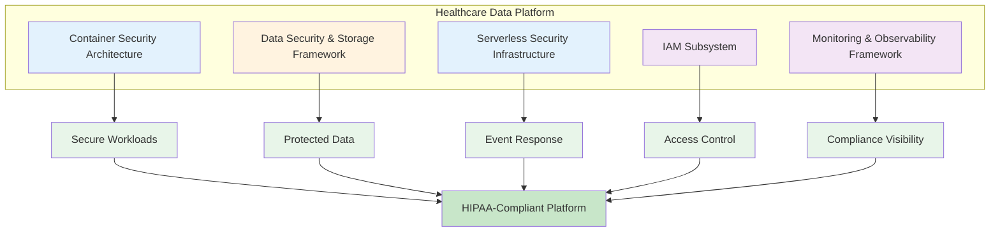

## Proposal Development Overview
> **Note:** This section is included for tracking notebook development progress and will be removed upon final version of the notebook.

| Section | Description | Key Components | Status | Iteration | Notes | Date | Author | Action Items |
|---------|-------------|----------------|:------:|:---------:|-------|------|--------|--------------|
| **1. Introduction and System Requirements** | Problem statement and requirements analysis | • Problem Statement<br>• Requirements Analysis<br>• System Constraints and Considerations | 🟢 | 2 | High-level technical scope aligned with initial requirements explicitly defined in README<br>• Only includes explicitly stated technologies<br>• Avoids implementation specifics<br>• URL references all verified and valid | 2025-06-09 | Chris Trauco | |
| **2. Container Security Architecture** | Kubernetes RBAC and cluster security controls, Docker container security and image scanning | • Architecture Considerations<br>• Security Design<br>• Implementation Approach | 🟢 | 2 | High-level technical scope aligned with initial requirements explicitly defined in README<br>• Only includes explicitly stated technologies<br>• Avoids implementation specifics<br>• URL references all verified and valid | 2025-06-09 | Chris Trauco | |
| **3. Data Security and Storage Framework** | Cloud Storage encryption and access controls, BigQuery data governance and compliance monitoring | • Security Strategy<br>• Compliance Design | 🟢 | 2 | High-level technical scope aligned with initial requirements explicitly defined in README<br>• Only includes explicitly stated technologies<br>• Avoids implementation specifics<br>• URL references all verified and valid | 2025-06-09 | Chris Trauco | |
| **4. Serverless Security Infrastructure** | Cloud Functions access controls and authentication, Event-driven security monitoring and response | • Architecture Considerations<br>• Security Design<br>• Monitoring Design | 🟢 | 2 | High-level technical scope aligned with initial requirements explicitly defined in README<br>• Only includes explicitly stated technologies<br>• Avoids implementation specifics<br>• URL references all verified and valid | 2025-06-09 | Chris Trauco | |
| **5. Identity and Access Management Subsystem** | Role-based access control architecture, Privilege management and least-privilege enforcement | • IAM Architecture<br>• RBAC Design<br>• Access Control Strategy | 🟢 | 2 | High-level technical scope aligned with initial requirements explicitly defined in README<br>• Only includes explicitly stated technologies<br>• Avoids implementation specifics<br>• URL references all verified and valid | 2025-06-09 | Chris Trauco | |
| **6. Monitoring and Observability Framework** | Container and serverless security monitoring, Compliance dashboards and audit reporting | • Container Security Monitoring Design<br>• Serverless Security Monitoring Design<br>• Compliance Dashboard Design<br>• Audit Reporting Design | 🟢 | 2 | High-level technical scope aligned with initial requirements explicitly defined in README<br>• Only includes explicitly stated technologies<br>• Avoids implementation specifics<br>• URL references all verified and valid | 2025-06-09 | Chris Trauco | |
| **7. Optional Demonstration Components** | Barebones skeleton components for potential post-proposal development | • Container Security Scanner<br>• IAM Policy Validator<br>• Compliance Monitor<br>• Security Event Processor<br>• Audit Trail Aggregator | 🟢 | 2 | Illustrative examples only<br>• High-level technical scope aligned with initial requirements explicitly defined in README<br>• Only includes explicitly stated technologies<br>• Avoids implementation specifics<br>• URL references all verified and valid | 2025-06-09 | Chris Trauco | |
| **8. Key Recommendations** | Strategic guidance and best practices | • Security Architecture<br>• Compliance Strategy | 🟢 | 2 | High-level technical scope aligned with initial requirements explicitly defined in README<br>• Only includes explicitly stated technologies<br>• Avoids implementation specifics<br>• URL references all verified and valid | 2025-06-09 | Chris Trauco | |

**Status Key:** 🔴 Not Started | 🟡 In Progress | 🟢 Complete

### 1.1 Problem Statement

A healthcare technology company wants to build a secure data analytics platform using containerized workloads and [Cloud Storage](https://cloud.google.com/storage/docs) for sensitive patient data analysis. They need guidance on:

- [Kubernetes](https://kubernetes.io/docs/) security architecture
- [Docker](https://docs.docker.com/) container protection  
- [Cloud Functions](https://cloud.google.com/functions/docs) access controls
- [BigQuery](https://cloud.google.com/bigquery/docs) compliance integration

This represents a fundamental systems challenge requiring coordination of multiple security components while maintaining [HIPAA compliance](https://www.hhs.gov/hipaa/for-professionals/compliance-enforcement/audit/index.html) for patient data. Healthcare organizations must ensure that patient information remains protected throughout its lifecycle, from initial storage through advanced analytics processing, while enabling legitimate medical research and operational insights. The complexity increases when considering the need for scalable infrastructure that can handle growing data volumes without compromising security or regulatory compliance.

### 1.2 Requirements Analysis

Based on the healthcare technology company's needs, the following requirements have been identified for the secure data analytics platform.

#### Container Security Requirements
- **[Kubernetes](https://kubernetes.io/docs/) RBAC**: Implement role-based access control for cluster security to ensure only authorized healthcare personnel and applications can access specific container resources, preventing unauthorized access to patient data processing workloads.

- **[Docker](https://docs.docker.com/) Security**: Container image scanning and runtime protection are essential for identifying vulnerabilities before deployment and ensuring healthcare applications run in secure, isolated environments.

- **Cluster Controls**: [Kubernetes](https://kubernetes.io/docs/) security policies must enforce strict boundaries between different healthcare services, preventing cross-contamination of patient data across containerized workloads.

#### Data Security Requirements
- **[Cloud Storage](https://cloud.google.com/storage/docs) Encryption**: Encryption at rest and in transit for patient data ensures confidentiality throughout the data lifecycle, meeting [HIPAA](https://www.hhs.gov/hipaa/for-professionals/compliance-enforcement/audit/index.html) requirements for protecting electronic health information.

- **Access Controls**: [IAM](https://cloud.google.com/iam/docs) policies for Cloud Storage buckets must restrict access to authorized healthcare professionals only, implementing the principle of least privilege for patient data access.

- **[BigQuery](https://cloud.google.com/bigquery/docs) Governance**: Data access logging and compliance monitoring provide audit trails required for regulatory compliance and enable tracking of all analytics operations on patient data.

#### Serverless Security Requirements
- **[Cloud Functions](https://cloud.google.com/functions/docs) Authentication**: Secure authentication mechanisms ensure that only verified healthcare applications can invoke functions that process sensitive patient information.

- **Event Monitoring**: Security event capture enables real-time detection of potential threats and automated response to protect patient data from unauthorized access or breaches.

- **Access Controls**: Function-level permissions and invocation policies prevent unauthorized execution of serverless workloads that handle healthcare data.

#### Compliance and Monitoring Requirements
- **HIPAA Adherence**: All platform components must implement controls for patient data protection and maintain comprehensive audit trails as required by healthcare regulations.

- **Continuous Monitoring**: Real-time security event detection across all platform layers ensures immediate identification and response to potential threats to patient data.

- **Compliance Validation**: Automated policy enforcement and reporting demonstrate ongoing adherence to healthcare regulations and provide evidence for compliance audits.

### 1.3 System Constraints and Considerations

#### Technical Constraints
- **Containerized Workloads**: The platform must support [Docker](https://docs.docker.com/) containers and [Kubernetes](https://kubernetes.io/docs/) orchestration to enable scalable deployment of healthcare analytics applications while maintaining isolation between different patient data processing services.

- **[Cloud Storage](https://cloud.google.com/storage/docs) Integration**: Sensitive patient data requires specific storage architecture with encryption, access controls, and audit capabilities to meet healthcare regulatory requirements for data protection.

- **Serverless Requirements**: [Cloud Functions](https://cloud.google.com/functions/docs) must integrate seamlessly with existing healthcare systems while maintaining strict security boundaries and authentication mechanisms for patient data processing.

- **[BigQuery](https://cloud.google.com/bigquery/docs) Compliance**: The analytics platform must maintain [HIPAA](https://www.hhs.gov/hipaa/for-professionals/compliance-enforcement/audit/index.html) compliance during all query operations, ensuring patient data remains protected even during complex analytical processing.

#### Security Constraints
- **HIPAA Compliance**: All components must meet healthcare regulatory requirements for protecting electronic health information, including encryption, access controls, and comprehensive audit logging.

- **Defense-in-Depth**: Multiple layers of security controls are required to protect patient data from various threat vectors, ensuring no single point of failure can compromise sensitive healthcare information.

- **Access Control**: Strict authentication and authorization mechanisms must verify the identity of all users and services accessing patient data, implementing role-based permissions aligned with healthcare job functions.

- **Audit Requirements**: Comprehensive logging and monitoring capabilities must capture all access to patient data, providing detailed audit trails for compliance reviews and security investigations.

#### Design Considerations
- **Scalability**: The system must handle growing patient data volumes as healthcare organizations expand their analytics capabilities without degrading security or performance.

- **Integration**: All components must work seamlessly within the [GCP](https://cloud.google.com/) ecosystem while maintaining security boundaries and compliance requirements for healthcare data.

- **Automation**: Governance and compliance checks must be automated to ensure consistent enforcement of security policies without manual intervention that could introduce human error.

- **Observability**: Security events must be visible and actionable through comprehensive monitoring dashboards, enabling healthcare IT teams to respond quickly to potential threats.

#### Implementation Considerations
- **Container Security Architecture**: [Kubernetes](https://kubernetes.io/docs/) RBAC and [Docker](https://docs.docker.com/) security controls form the foundation for secure containerized workloads processing patient data.

- **Data Security and Storage Framework**: [Cloud Storage](https://cloud.google.com/storage/docs) encryption and [BigQuery](https://cloud.google.com/bigquery/docs) governance ensure patient data protection throughout storage and analytics operations.

- **Serverless Security Infrastructure**: [Cloud Functions](https://cloud.google.com/functions/docs) access controls and monitoring provide secure event-driven processing for healthcare workflows.

- **Identity and Access Management Subsystem**: RBAC architecture and privilege management through [Cloud IAM](https://cloud.google.com/iam/docs) enforce appropriate access boundaries for healthcare personnel.

- **Monitoring and Observability Framework**: Security monitoring and compliance reporting through [Cloud Monitoring](https://cloud.google.com/monitoring/docs) and [Cloud Logging](https://cloud.google.com/logging/docs) maintain visibility into all platform operations.

### 1.4 Healthcare Data Platform Architecture Overview

A secure healthcare data platform is a comprehensive system designed to protect sensitive patient information while enabling advanced analytics and data-driven insights. This architecture integrates multiple security layers and compliance controls to ensure that healthcare organizations can leverage their data assets without compromising patient privacy or violating regulatory requirements.

#### The Five Core Components

- **Container Security Architecture**: Provides secure, isolated workloads through [Kubernetes](https://kubernetes.io/docs/) and [Docker](https://docs.docker.com/), essential for preventing cross-contamination of patient data.

- **Data Security and Storage Framework**: Implements [Cloud Storage](https://cloud.google.com/storage/docs) encryption and [BigQuery](https://cloud.google.com/bigquery/docs) governance to protect patient data at rest and during analytics processing.

- **Serverless Security Infrastructure**: Leverages [Cloud Functions](https://cloud.google.com/functions/docs) for event-driven security responses and automated compliance checks without infrastructure overhead.

- **Identity and Access Management (IAM) Subsystem**: Enforces role-based access control through [Cloud IAM](https://cloud.google.com/iam/docs), ensuring healthcare professionals only access data required for their specific roles.

- **Monitoring and Observability Framework**: Provides continuous security visibility and compliance tracking through [Cloud Monitoring](https://cloud.google.com/monitoring/docs) and [Cloud Logging](https://cloud.google.com/logging/docs), maintaining audit trails for regulatory requirements.

#### Integrated Platform Architecture



*This integrated architecture ensures comprehensive security and compliance for healthcare data through layered controls and continuous monitoring.*

#### 1.5 Summary
This section has identified the key requirements and constraints for developing a secure healthcare data analytics platform on [GCP](https://cloud.google.com/). The main challenges center around:

1. **Security Requirements**: Implementing container security through [Kubernetes](https://kubernetes.io/docs/) and [Docker](https://docs.docker.com/), data protection with [Cloud Storage](https://cloud.google.com/storage/docs) encryption, and serverless access controls via [Cloud Functions](https://cloud.google.com/functions/docs) to ensure patient data remains protected across all platform layers.

2. **Compliance Needs**: Ensuring [HIPAA compliance](https://www.hhs.gov/hipaa/for-professionals/compliance-enforcement/index.html) across all system components with comprehensive audit trails, access controls, and continuous monitoring to meet healthcare regulatory requirements for electronic health information protection.

3. **System Integration**: Building a systematic [GCP](https://cloud.google.com/)-based approach that coordinates multiple security components while maintaining the scalability needed for growing patient data volumes and evolving healthcare analytics requirements.

The subsequent sections will detail the technical architecture and implementation approach to address these requirements within the identified constraints, ensuring patient data protection remains paramount throughout the platform design.

### 2.1 Architecture Considerations

The container security architecture for the healthcare data platform centers on two key components that work together to protect containerized workloads:

#### Kubernetes Security
- **RBAC Implementation**: Establishes [role-based access control](https://kubernetes.io/docs/reference/access-authn-authz/rbac/) for cluster resources, ensuring only authorized users and services can access healthcare workloads. This prevents unauthorized access to patient data processing environments.

- **Cluster Security Controls**: Implements security policies and controls for the [Kubernetes](https://kubernetes.io/docs/) environment to maintain secure boundaries between different healthcare services and applications.

#### Docker Security
- **Container Security**: Provides protection mechanisms for [Docker](https://docs.docker.com/) containers, ensuring each healthcare application runs in isolation to prevent data leakage between services.

- **Image Scanning**: Enables vulnerability detection for container images before deployment, critical for identifying security risks that could expose patient data.

### 2.2 Container Security Architecture

The following diagram illustrates how Kubernetes and Docker security components work together to protect the healthcare data platform:

```mermaid
flowchart TB
    subgraph "Kubernetes Security"
        K1[RBAC Implementation]
        K2[Cluster Security Controls]
    end
    
    subgraph "Docker Security"
        D1[Container Security]
        D2[Image Scanning]
    end
    
    K1 & K2 --> HP[Healthcare Platform Protection]
    D1 & D2 --> HP
    
    HP --> SW[Secure Workloads]
    HP --> CI[Compliance & Isolation]
    
    style K1 fill:#e3f2fd
    style K2 fill:#e3f2fd
    style D1 fill:#e3f2fd
    style D2 fill:#e3f2fd
    style HP fill:#e8f5e9
    style SW fill:#e8f5e9
    style CI fill:#e8f5e9

### 2.3 Security Design

#### RBAC Design
- **Access Control Strategy**: Defines roles and permissions for healthcare platform users, ensuring data scientists, administrators, and operators only access resources necessary for their specific functions.

- **Security Policy Framework**: Establishes cluster-wide security controls to enforce consistent protection standards across all healthcare workloads deployed on the platform.

#### Container Security Design
- **Docker Security Approach**: Implements security configurations for container deployment, including runtime protection and resource isolation for healthcare applications.

- **Image Scanning Strategy**: Establishes vulnerability assessment processes to identify and remediate security risks in container images before they enter the healthcare environment.

### 2.4 Implementation Approach

#### RBAC Implementation
- **Configuration Strategy**: Defines the approach for setting up [Kubernetes RBAC](https://kubernetes.io/docs/reference/access-authn-authz/rbac/) with healthcare-specific roles, ensuring proper access controls are in place before deploying patient data workloads.

- **Security Control Deployment**: Outlines the method for implementing cluster security controls that protect healthcare applications from unauthorized access and potential security breaches.

#### Container Security Implementation
- **Docker Security Deployment**: Describes the approach for implementing [Docker](https://docs.docker.com/) container security measures, ensuring all healthcare workloads run with appropriate isolation and protection.

- **Image Scanning Integration**: Details the process for incorporating vulnerability scanning into the container deployment pipeline, preventing compromised images from processing patient data.

### 2.5 Summary

This section has outlined the container security architecture focusing on:

1. **[Kubernetes](https://kubernetes.io/docs/) Security**: RBAC implementation and cluster security controls that ensure only authorized healthcare personnel can access containerized workloads, preventing unauthorized access to patient data processing environments.

2. **[Docker](https://docs.docker.com/) Security**: Container protection and image scanning capabilities that identify vulnerabilities before deployment, ensuring healthcare applications run in secure, isolated environments.

These components provide the foundation for secure containerized workloads essential for processing sensitive patient data while maintaining [HIPAA compliance](https://www.hhs.gov/hipaa/index.html). The architecture ensures proper isolation between healthcare services and prevents cross-contamination of patient information across different container deployments. The next section will address the data security and storage framework.

## 3. Data Security and Storage Framework

### 3.1 Security Strategy

The data security framework for healthcare patient data focuses on two core components that ensure comprehensive protection throughout the data lifecycle:

#### Cloud Storage Security
- **Encryption**: Implements data encryption at rest and in transit using [Cloud Storage](https://cloud.google.com/storage/docs) encryption features, ensuring patient data remains protected whether stored or being transferred between services.

- **Access Controls**: Establishes [IAM policies](https://cloud.google.com/iam/docs) for Cloud Storage buckets, restricting access to authorized healthcare personnel and applications based on the principle of least privilege.

#### BigQuery Security
- **Data Governance**: Provides access control and data classification within [BigQuery](https://cloud.google.com/bigquery/docs), ensuring analytics queries only expose patient data to authorized users with legitimate healthcare purposes.

- **Compliance Monitoring**: Enables audit logging and compliance tracking for all data access events, maintaining the detailed records required for [HIPAA](https://www.hhs.gov/hipaa/for-professionals/compliance-enforcement/audit/index.html) compliance and regulatory audits.

### 3.2 Compliance Design

#### Storage Compliance Framework
- **HIPAA-Compliant Storage**: Configures [Cloud Storage](https://cloud.google.com/storage/docs) with security settings that meet healthcare regulatory requirements, including encryption, access controls, and data retention policies.

- **Access Logging**: Implements comprehensive audit trails for all data access events, providing the detailed tracking necessary for compliance audits and security investigations.

#### Analytics Compliance
- **BigQuery Compliance Controls**: Establishes data governance controls within [BigQuery](https://cloud.google.com/bigquery/docs) to ensure analytics operations maintain patient privacy and meet regulatory requirements.

- **Monitoring Integration**: Connects compliance monitoring with the broader platform observability framework, enabling real-time validation of data access patterns and automated compliance reporting.

### 3.3 Implementation Approach

#### Cloud Storage Implementation
- **Encryption Configuration**: Outlines the setup for data protection using [Cloud Storage](https://cloud.google.com/storage/docs) encryption, ensuring all patient data is encrypted at rest and in transit.

- **Access Control Deployment**: Describes the implementation of IAM policies that restrict Cloud Storage bucket access to authorized healthcare users and services only.

#### BigQuery Implementation
- **Governance Setup**: Details the configuration of data access controls and classification within [BigQuery](https://cloud.google.com/bigquery/docs), ensuring analytics operations comply with healthcare regulations.

- **Compliance Monitoring**: Defines the deployment of audit logging and tracking mechanisms to maintain continuous visibility into data access patterns and compliance status.

### 3.4 Data Security Architecture

The following diagram illustrates how Cloud Storage and BigQuery security components work together to protect patient data:

```mermaid
flowchart TB
   subgraph "Cloud Storage Security"
       CS1[Encryption]
       CS2[Access Controls]
   end
   
   subgraph "BigQuery Security"
       BQ1[Data Governance]
       BQ2[Compliance Monitoring]
   end
   
   CS1 & CS2 --> STORAGE[Protected Storage]
   STORAGE --> BQ1
   BQ1 --> BQ2
   BQ2 --> ANALYTICS[Compliant Analytics]
   
   STORAGE --> AUDIT[Audit Trails]
   ANALYTICS --> AUDIT
   
   style CS1 fill:#fff3e0
   style CS2 fill:#fff3e0
   style BQ1 fill:#fff3e0
   style BQ2 fill:#fff3e0
   style STORAGE fill:#e8f5e9
   style ANALYTICS fill:#e8f5e9
   style AUDIT fill:#e8f5e9

#### 3.5 Summary

This section has outlined the data security and storage framework focusing on:

1. **[Cloud Storage](https://cloud.google.com/storage/docs)**: Encryption and access controls that protect patient data at rest and in transit, ensuring confidentiality throughout the data lifecycle as required by [HIPAA](https://www.hhs.gov/hipaa/index.html) regulations.

2. **[BigQuery](https://cloud.google.com/bigquery/docs)**: Data governance and compliance monitoring that maintain audit trails for all analytics operations, providing the visibility needed for regulatory compliance and security investigations.

These components ensure secure storage and compliant analytics for sensitive healthcare data by implementing defense-in-depth strategies across the data layer. The framework provides comprehensive protection from initial data ingestion through advanced analytics processing, maintaining patie

## 4. Serverless Security Infrastructure

### 4.1 Architecture Considerations

The serverless security infrastructure leverages event-driven computing to provide scalable, automated security responses without managing underlying infrastructure:

#### Cloud Functions Security
- **Access Controls**: Implements [Cloud Functions](https://cloud.google.com/functions/docs) authentication mechanisms to ensure only authorized services and users can invoke serverless functions that process patient data.

- **Authentication**: Establishes service-level security configurations to verify the identity of systems accessing healthcare functions and prevent unauthorized invocations.

#### Event-Driven Security
- **Security Monitoring**: Enables event-driven security monitoring that automatically responds to security events across the healthcare platform.

- **Response**: Provides automated security event response capabilities, allowing the platform to immediately address potential threats without manual intervention.

### 4.2 Security Design

#### Cloud Functions Design
- **Access Control Framework**: Defines authentication and authorization requirements for [Cloud Functions](https://cloud.google.com/functions/docs), ensuring healthcare data processing functions are only accessible to authorized users and services.

- **Security Configuration**: Establishes function-level security settings that protect serverless workloads from unauthorized access while maintaining compliance with healthcare regulations.

#### Event Monitoring Design
- **Monitoring Architecture**: Creates an event-driven security monitoring design that captures and analyzes security events across the healthcare platform in real-time.

- **Response Framework**: Develops security event response mechanisms that automatically trigger appropriate actions when potential security issues are detected.

### 4.3 Implementation Approach

#### Cloud Functions Implementation
- **Access Control Setup**: Describes the configuration of authentication and authorization for [Cloud Functions](https://cloud.google.com/functions/docs), ensuring secure invocation patterns for healthcare data processing.

- **Security Deployment**: Outlines the implementation of function security settings that protect serverless workloads while maintaining operational efficiency.

#### Event Monitoring Implementation
- **Monitoring Deployment**: Details the setup of event-driven security monitoring to capture and process security events across the healthcare platform.

- **Response Configuration**: Defines the implementation of automated security event response mechanisms that address threats without disrupting healthcare operations.

### 4.4 Serverless Security Architecture

The following diagram illustrates how Cloud Functions and event-driven security components work together:

```mermaid
flowchart TB
   subgraph "Cloud Functions Security"
       CF1[Access Controls]
       CF2[Authentication]
   end
   
   subgraph "Event-Driven Security"
       ED1[Security Monitoring]
       ED2[Event Response]
   end
   
   CF1 & CF2 --> SECURE[Secure Functions]
   ED1 --> ED2
   ED2 --> AUTO[Automated Response]
   
   SECURE --> PROCESS[Protected Processing]
   AUTO --> PROCESS
   
   PROCESS --> COMPLIANT[Compliant Serverless Layer]
   
   style CF1 fill:#e3f2fd
   style CF2 fill:#e3f2fd
   style ED1 fill:#e3f2fd
   style ED2 fill:#e3f2fd
   style SECURE fill:#e8f5e9
   style AUTO fill:#e8f5e9
   style PROCESS fill:#e8f5e9
   style COMPLIANT fill:#c8e6c9

#### 4.5 Summary

This section has outlined the serverless security infrastructure focusing on:

1. **[Cloud Functions](https://cloud.google.com/functions/docs)**: Access controls and authentication mechanisms that ensure only authorized services can invoke serverless functions processing patient data, preventing unauthorized execution of healthcare workflows.

2. **Event-Driven Security**: Monitoring and automated response capabilities that detect and address security events in real-time, protecting the healthcare platform from emerging threats without manual intervention.

These components provide secure serverless computing capabilities essential for scalable healthcare operations while maintaining [HIPAA compliance](https://www.hhs.gov/hipaa/index.html). The infrastructure enables rapid, automated responses to security events while ensuring all serverless workloads operate within defined security boundaries. The next section will address the identity and access management subsystem.

## 5. Identity and Access Management Subsystem

### 5.1 IAM Architecture

The identity and access management subsystem provides centralized control over who can access healthcare platform resources and what actions they can perform:

#### Role-Based Access Control
- **RBAC Architecture**: Implements role-based access control design using [Cloud IAM](https://cloud.google.com/iam/docs) to manage permissions across all platform components and healthcare data resources.

- **Role Definition**: Creates healthcare-specific role structures that align with organizational responsibilities, ensuring staff members only access data necessary for their job functions.

#### Privilege Management
- **Least-Privilege Enforcement**: Applies minimal permission assignment principles, granting users and services only the access rights required to perform their specific healthcare tasks.

- **Access Control Policies**: Establishes permission boundaries and restrictions that prevent privilege escalation and unauthorized access to sensitive patient data.

### 5.2 RBAC Design

#### Healthcare Role Design
- **Role Structure**: Defines roles aligned with healthcare team functions, including data analysts, clinical researchers, system administrators, and compliance officers, each with appropriate access levels.

- **Permission Model**: Establishes access rights based on job responsibilities, ensuring healthcare professionals can only interact with patient data relevant to their specific duties.

#### Access Control Strategy
- **Permission Boundaries**: Sets defined limits for each role, preventing users from accessing resources outside their authorized scope within the healthcare platform.

- **Enforcement Mechanisms**: Implements automated privilege management that continuously validates and enforces access policies across all platform services.

### 5.3 Implementation Approach

#### RBAC Implementation
- **Role Configuration**: Outlines the setup of role-based access control using [Cloud IAM](https://cloud.google.com/iam/docs), defining healthcare-specific roles and their associated permissions.

- **Policy Deployment**: Details the implementation of access policies that enforce security boundaries and ensure compliance with healthcare regulations.

#### Privilege Management Implementation
- **Least-Privilege Setup**: Describes the configuration of minimal permissions for users and services, reducing the risk of unauthorized access to patient data.

- **Enforcement Deployment**: Explains the automated privilege management implementation that continuously monitors and adjusts access rights based on defined policies.

### 5.4 IAM Architecture

The following diagram illustrates how role-based access control and privilege management work together:

```mermaid
flowchart TB
   subgraph "RBAC Components"
       R1[Role Architecture]
       R2[Access Control]
   end
   
   subgraph "Privilege Management"
       P1[Least-Privilege]
       P2[Enforcement]
   end
   
   R1 & R2 --> ROLES[Healthcare Roles]
   P1 & P2 --> POLICIES[Access Policies]
   
   ROLES --> CONTROL[Controlled Access]
   POLICIES --> CONTROL
   
   CONTROL --> USERS[Healthcare Users & Services]
   
   style R1 fill:#f3e5f5
   style R2 fill:#f3e5f5
   style P1 fill:#f3e5f5
   style P2 fill:#f3e5f5
   style ROLES fill:#e8f5e9
   style POLICIES fill:#e8f5e9
   style CONTROL fill:#e8f5e9
   style USERS fill:#c8e6c9

#### 5.5 Summary

This section has defined the identity and access management subsystem focusing on:

1. **Role-Based Access Control**: Architecture and implementation using [Cloud IAM](https://cloud.google.com/iam/docs) that defines healthcare-specific roles aligned with job functions, ensuring staff only access patient data necessary for their responsibilities.

2. **Privilege Management**: Least-privilege enforcement and automated access control policies that prevent unauthorized escalation and maintain strict boundaries around sensitive healthcare resources.

These components ensure proper authentication and authorization across the healthcare platform by implementing granular access controls that align with healthcare organizational structures. The IAM subsystem provides the foundation for all platform security by controlling who can access resources and what actions they can perform on patient data. The next section will address monitoring and observability framework.

## 6. Monitoring and Observability Framework

### 6.1 Container Security Monitoring Design

The monitoring framework provides comprehensive visibility into security events across containerized and serverless workloads:

#### Container Security Monitoring
- **Security Monitoring**: Tracks container security events using [Cloud Monitoring](https://cloud.google.com/monitoring/docs) to detect potential threats and policy violations in real-time.

- **Alert Framework**: Implements security incident detection and notification systems that immediately alert administrators to suspicious activities or breaches.

#### Serverless Security Monitoring  
- **Function Monitoring**: Monitors [Cloud Functions](https://cloud.google.com/functions/docs) security events to ensure serverless workloads operate within defined security parameters.

- **Event Tracking**: Captures and analyzes serverless security events using [Cloud Logging](https://cloud.google.com/logging/docs) to maintain complete visibility into function invocations and access patterns.

### 6.2 Compliance Dashboard Design

#### Dashboard Components
- **Security Metrics**: Provides real-time visualization of security status across all platform components, enabling healthcare teams to monitor the overall security posture at a glance.

- **Compliance Indicators**: Tracks healthcare regulatory compliance metrics, displaying [HIPAA](https://www.hhs.gov/hipaa/for-professionals/security/laws-regulations/index.html) adherence status and flagging potential compliance issues for immediate attention.

#### Reporting Framework
- **Automated Reporting**: Generates scheduled compliance reports using [BigQuery](https://cloud.google.com/bigquery/docs) analytics, providing stakeholders with regular updates on security and compliance status.

- **Audit Trail Dashboard**: Creates centralized visualization of audit events from [Cloud Logging](https://cloud.google.com/logging/docs), enabling compliance officers to review access patterns and investigate incidents.

### 6.3 Audit Reporting Design

#### Audit Framework
- **Event Collection**: Aggregates security events from all platform components using [Cloud Logging](https://cloud.google.com/logging/docs), creating a comprehensive record of all access and activity within the healthcare platform.

- **Compliance Validation**: Implements automated compliance checks that validate adherence to healthcare regulations and generate reports for regulatory audits.

#### Report Generation
- **Security Reports**: Produces periodic documentation of the platform's security posture, highlighting potential vulnerabilities and tracking remediation efforts over time.

- **Audit Trail Reports**: Generates detailed access and activity documentation required for [HIPAA](https://www.hhs.gov/hipaa/index.html) compliance audits and internal security reviews.

### 6.4 Monitoring and Observability Architecture

The following diagram illustrates how monitoring components work together to provide comprehensive visibility:

```mermaid
flowchart TB
   subgraph "Security Monitoring"
       M1[Container Monitoring]
       M2[Serverless Monitoring]
   end
   
   subgraph "Compliance Tracking"
       C1[Compliance Dashboards]
       C2[Audit Reporting]
   end
   
   M1 & M2 --> EVENTS[Security Events]
   EVENTS --> C1
   EVENTS --> C2
   
   C1 --> VISIBILITY[Real-time Visibility]
   C2 --> REPORTS[Compliance Reports]
   
   VISIBILITY & REPORTS --> OVERSIGHT[Complete Security Oversight]
   
   style M1 fill:#f3e5f5
   style M2 fill:#f3e5f5
   style C1 fill:#f3e5f5
   style C2 fill:#f3e5f5
   style EVENTS fill:#e8f5e9
   style VISIBILITY fill:#e8f5e9
   style REPORTS fill:#e8f5e9
   style OVERSIGHT fill:#c8e6c9

### 6.5 Implementation Approach

#### Monitoring Implementation
- **Security Monitoring Setup**: Deploys container and serverless monitoring using [Cloud Monitoring](https://cloud.google.com/monitoring/docs) to track security events across all platform components.

- **Alert Configuration**: Implements security event notification systems that immediately inform administrators of potential threats or policy violations.

#### Compliance Implementation
- **Dashboard Deployment**: Sets up compliance visualization tools that provide real-time insights into platform security and regulatory adherence status.

- **Report Automation**: Configures scheduled reporting using [BigQuery](https://cloud.google.com/bigquery/docs) and [Cloud Logging](https://cloud.google.com/logging/docs) to generate regular compliance documentation.

#### 6.6 Summary

This section has defined the monitoring and observability framework encompassing:

1. **Security Monitoring**: Container and serverless security event tracking through [Cloud Monitoring](https://cloud.google.com/monitoring/docs) that provides real-time visibility into potential threats and policy violations across all platform components.

2. **Compliance Dashboards**: Real-time compliance visualization using [BigQuery](https://cloud.google.com/bigquery/docs) analytics that tracks [HIPAA](https://www.hhs.gov/hipaa/for-professionals/compliance-enforcement/index.html) adherence and identifies potential regulatory issues before they become violations.

3. **Audit Reporting**: Comprehensive audit trail documentation via [Cloud Logging](https://cloud.google.com/logging/docs) that captures all access to patient data, providing the detailed records required for regulatory audits and security investigations.

These components provide complete visibility into security posture and regulatory compliance by integrating monitoring across all platform layers. The framework ensures healthcare organizations can demonstrate continuous compliance while maintaining the ability to rapidly respond to security incidents. The next section will outline optional demonstration components.

## 7. Optional Demonstration Components

### 7.1 Component Overview

*Note: These components are illustrative examples only and not required deliverables of this proposal.*

Should the proposal be accepted, the following barebones skeleton components could be developed as building blocks for an end-to-end pipeline demonstration:

#### Security Components
- **Container Security Scanner**: Combines [GKE](https://cloud.google.com/kubernetes-engine/docs) with [Cloud Functions](https://cloud.google.com/functions/docs) to automatically scan container images for vulnerabilities before deployment.

- **IAM Policy Validator**: Integrates [Cloud IAM](https://cloud.google.com/iam/docs) with [Cloud Functions](https://cloud.google.com/functions/docs) to validate access policies against healthcare compliance requirements.

#### Compliance Components
- **Compliance Monitor**: Leverages [Cloud Monitoring](https://cloud.google.com/monitoring/docs), [BigQuery](https://cloud.google.com/bigquery/docs), and [Cloud Functions](https://cloud.google.com/functions/docs) to track and report on compliance metrics.

- **Security Event Processor**: Uses [Cloud Logging](https://cloud.google.com/logging/docs) with [Cloud Functions](https://cloud.google.com/functions/docs) to process and respond to security events in real-time.

- **Audit Trail Aggregator**: Combines [Cloud Logging](https://cloud.google.com/logging/docs), [BigQuery](https://cloud.google.com/bigquery/docs), and [Cloud Storage](https://cloud.google.com/storage/docs) to create comprehensive audit trails for compliance reporting.

### 7.2 Implementation Considerations

#### Development Approach
- **Skeleton Framework**: Each component would be developed as a basic structure demonstrating core functionality without full production features.

- **Integration Points**: Components would use standard interfaces to connect with other platform services, showing how the healthcare security ecosystem works together.

#### Technology Stack
- **Primary Services**: The demonstration would utilize [GKE](https://cloud.google.com/kubernetes-engine/docs) for container orchestration, [Cloud Functions](https://cloud.google.com/functions/docs) for serverless computing, and [BigQuery](https://cloud.google.com/bigquery/docs) for analytics.

- **Supporting Services**: Additional platform capabilities would include [Cloud IAM](https://cloud.google.com/iam/docs) for access control, [Cloud Monitoring](https://cloud.google.com/monitoring/docs) for observability, [Cloud Logging](https://cloud.google.com/logging/docs) for audit trails, and [Cloud Storage](https://cloud.google.com/storage/docs) for data persistence.

### 7.3 Component Architecture Visualization
The following diagram illustrates how the optional demonstration components could work together in an end-to-end security pipeline. These components integrate various GCP services to provide comprehensive security monitoring, compliance tracking, and audit capabilities for the healthcare data platform.

```mermaid
flowchart TB
    subgraph SecurityComponents ["Security Components"]
        A[Container Security Scanner]
        B[IAM Policy Validator]
    end
    
    subgraph ComplianceComponents ["Compliance Components"]
        C[Compliance Monitor]
        D[Security Event Processor]
        E[Audit Trail Aggregator]
    end
    
    A --> F[Security Reports]
    B --> F
    C --> G[Compliance Dashboards]
    D --> F
    D --> G
    E --> H[Audit Trails]
    
    style A fill:#e3f2fd
    style B fill:#e3f2fd
    style C fill:#fff3e0
    style D fill:#fff3e0
    style E fill:#fff3e0
    style F fill:#e8f5e9
    style G fill:#e8f5e9
    style H fill:#e8f5e9
```

*Note: This architecture represents potential building blocks that could be implemented post-proposal to demonstrate the integrated security and compliance capabilities of the platform.*

#### 7.4 Summary

This section has outlined optional demonstration components that could be developed post-proposal:

1. **Security Components**: Container security scanner combining [GKE](https://cloud.google.com/kubernetes-engine/docs) and [Cloud Functions](https://cloud.google.com/functions/docs), and IAM policy validator integrating [Cloud IAM](https://cloud.google.com/iam/docs) with serverless functions to automate security validation.

2. **Compliance Components**: Compliance monitor leveraging [Cloud Monitoring](https://cloud.google.com/monitoring/docs), [BigQuery](https://cloud.google.com/bigquery/docs), and [Cloud Functions](https://cloud.google.com/functions/docs); security event processor using [Cloud Logging](https://cloud.google.com/logging/docs); and audit trail aggregator combining multiple services for comprehensive compliance tracking.

These illustrative examples demonstrate potential building blocks for an end-to-end healthcare security pipeline implementation. While not required deliverables of this proposal, they show how the proposed architecture components could work together to create an integrated security and compliance ecosystem for protecting patient data.

## 8. Key Recommendations

This section provides strategic guidance for implementing the healthcare data platform security architecture, focusing on the core security and compliance requirements identified throughout this proposal.

### 8.1 Security Architecture Recommendations

The following recommendations ensure robust security across all platform components:

#### Container and Kubernetes Security
- **[Kubernetes](https://kubernetes.io/docs/) RBAC Implementation**: Establish comprehensive role-based access control before deploying any healthcare workloads to ensure proper authorization boundaries. This foundational security measure prevents unauthorized access to patient data processing environments and maintains separation between different healthcare services.

- **[Docker](https://docs.docker.com/) Image Security**: Implement automated vulnerability scanning for all container images to prevent security risks in the containerized environment. Regular scanning identifies potential vulnerabilities before they can be exploited, protecting patient data from known security threats.

#### Data Protection and Governance
- **[Cloud Storage](https://cloud.google.com/storage/docs) Encryption**: Enable encryption at rest and in transit for all patient data stored in Cloud Storage, ensuring data protection throughout its lifecycle. This encryption is essential for meeting [HIPAA](https://www.hhs.gov/hipaa/index.html) requirements for electronic health information protection.

- **[BigQuery](https://cloud.google.com/bigquery/docs) Compliance Integration**: Configure comprehensive audit logging and data governance controls to maintain visibility into all analytics operations. These controls provide the audit trails necessary for regulatory compliance and enable tracking of all queries against patient data.

### 8.2 Compliance Strategy Recommendations

These recommendations address healthcare regulatory requirements and operational compliance:

#### Access Control and Privilege Management
- **Least-Privilege Enforcement**: Implement minimal necessary permissions across all [GCP](https://cloud.google.com/) services, with regular reviews to ensure continued compliance. This approach reduces the risk of unauthorized access to patient data by limiting each user and service to only the resources required for their specific healthcare functions.

- **Comprehensive Audit Trails**: Maintain detailed logging across [Cloud Storage](https://cloud.google.com/storage/docs), [BigQuery](https://cloud.google.com/bigquery/docs), and [Cloud Functions](https://cloud.google.com/functions/docs) to support regulatory audits. These logs provide the evidence needed to demonstrate [HIPAA compliance](https://www.hhs.gov/hipaa/for-professionals/index.html) and investigate any potential security incidents.

#### Monitoring and Observability
- **Security Event Monitoring**: Deploy container and serverless security monitoring through [Cloud Monitoring](https://cloud.google.com/monitoring/docs) to maintain continuous visibility into platform security posture. Real-time monitoring enables rapid detection and response to potential threats before they can impact patient data.

- **Compliance Dashboard Implementation**: Establish real-time compliance dashboards using [BigQuery](https://cloud.google.com/bigquery/docs) analytics to track adherence to healthcare regulations and security policies. These dashboards provide healthcare administrators with immediate visibility into compliance status and potential issues requiring attention.

### 8.3 Summary

These recommendations provide a foundation for building a secure, compliant healthcare data analytics platform. By focusing on robust security architecture through [Kubernetes](https://kubernetes.io/docs/) and [Docker](https://docs.docker.com/) controls, comprehensive data protection with [Cloud Storage](https://cloud.google.com/storage/docs) and [BigQuery](https://cloud.google.com/bigquery/docs), and continuous compliance monitoring, the platform can meet both technical and regulatory requirements while maintaining the flexibility to scale with organizational needs. The emphasis on [HIPAA compliance](https://www.hhs.gov/hipaa/for-professionals/compliance-enforcement/index.html), least-privilege access, and comprehensive audit trails ensures patient data remains protected throughout all platform operations.


```python

```
