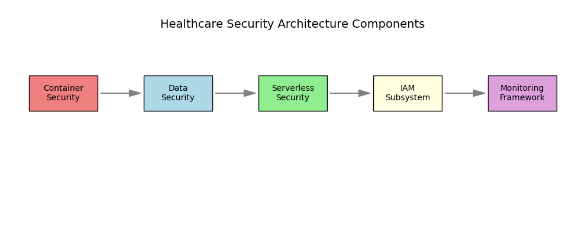
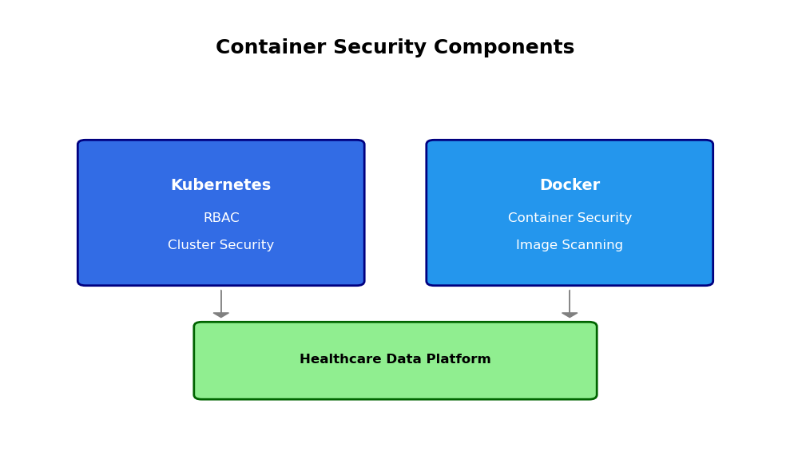
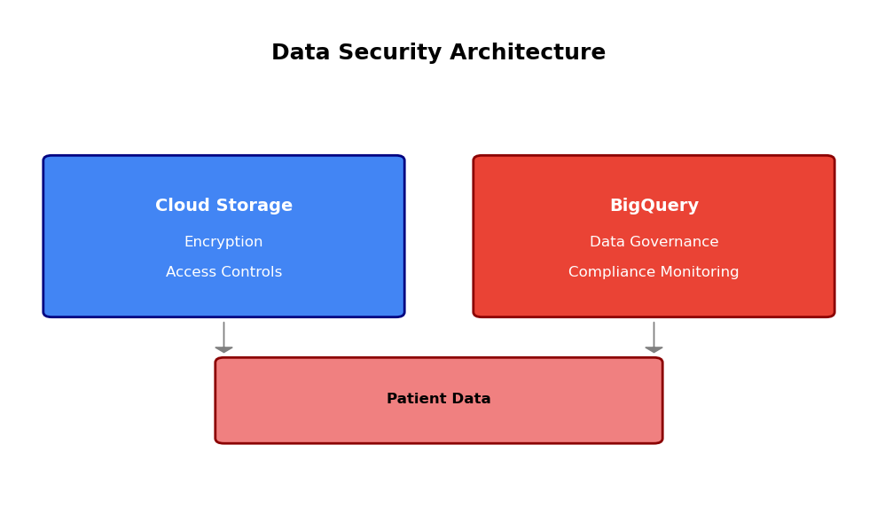
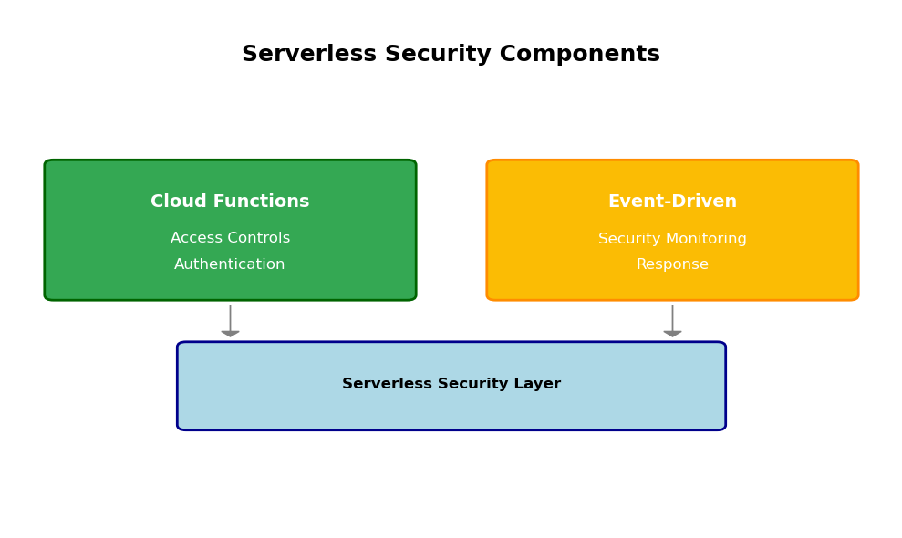
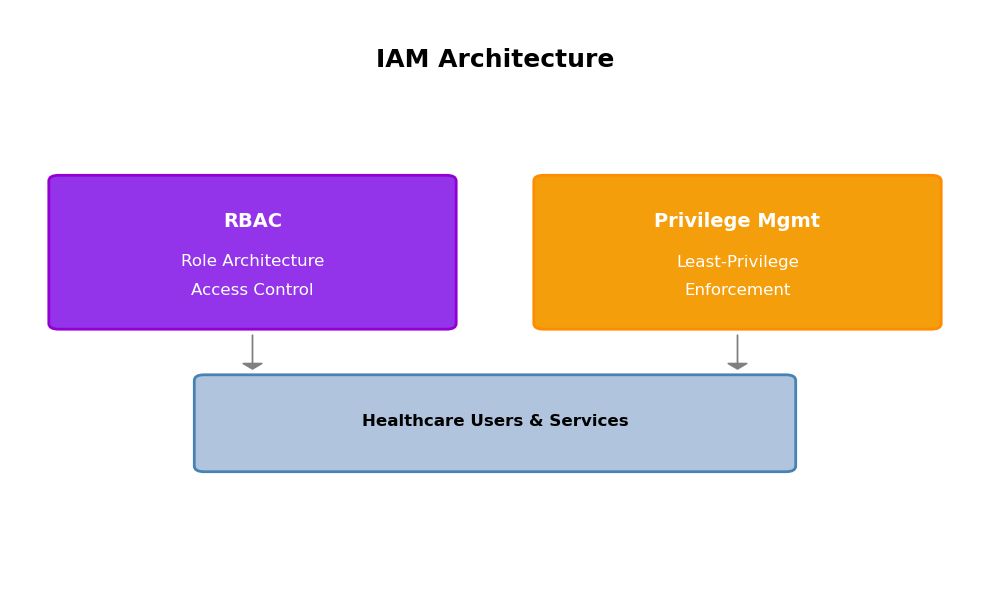
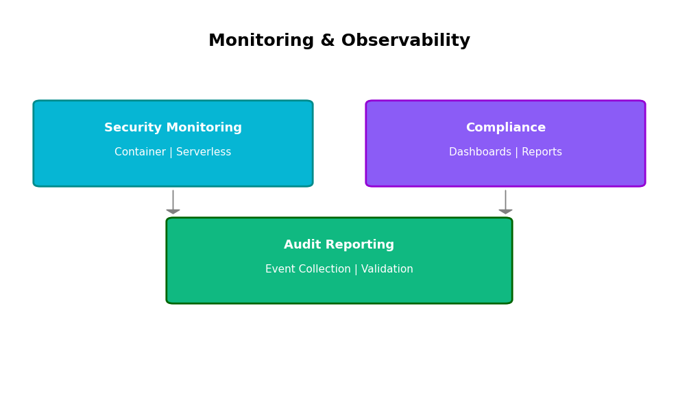

```python
import matplotlib.pyplot as plt
import matplotlib.patches as patches

# security architecture overview
fig, ax = plt.subplots(figsize=(10, 4))

# components
components = [
   'Container\nSecurity', 
   'Data\nSecurity', 
   'Serverless\nSecurity', 
   'IAM\nSubsystem', 
   'Monitoring\nFramework'
]
colors = ['lightcoral', 'lightblue', 'lightgreen', 'lightyellow', 'plum']
y_pos = 3

# draw boxes
for i, (component, color) in enumerate(zip(components, colors)):
   x = i * 2 + 1
   # box
   ax.add_patch(plt.Rectangle((x-0.6, y_pos-0.4), 1.2, 0.8,
                             fill=True, facecolor=color, edgecolor='black'))
   ax.text(x, y_pos, component, ha='center', va='center', fontsize=10)
   
   # arrow
   if i < len(components) - 1:
       ax.arrow(x + 0.65, y_pos, 0.5, 0, head_width=0.15,
               head_length=0.2, fc='gray', ec='gray')

# title
ax.text(5, 4.5, 'Healthcare Security Architecture Components', ha='center', fontsize=14)
ax.set_xlim(0, 10)
ax.set_ylim(0, 5)
ax.axis('off')
plt.tight_layout()
plt.show()
```


    

    


#### Summary

This section has identified the key requirements and constraints for developing a secure healthcare data analytics platform. The main challenges center around:

1. **Security Requirements**: Implementing container security, data protection, and serverless access controls
2. **Compliance Needs**: Ensuring HIPAA compliance across all system components  
3. **System Integration**: Building a systematic GCP-based approach as requested

The subsequent sections will detail the technical architecture and implementation approach to address these requirements within the identified constraints.

## 2. Container Security Architecture

### 2.1 Architecture Considerations

The container security architecture for the healthcare data platform centers on two key components:

#### Kubernetes Security
- **RBAC Implementation**: Role-based access control for cluster resources
- **Cluster Security Controls**: Security policies and controls for the Kubernetes environment

#### Docker Security
- **Container Security**: Protection mechanisms for Docker containers
- **Image Scanning**: Vulnerability detection for container images


```python
import matplotlib.pyplot as plt
import matplotlib.patches as patches

fig, ax = plt.subplots(1, 1, figsize=(10, 6))
ax.set_xlim(0, 10)
ax.set_ylim(0, 10)
ax.axis('off')

# title
ax.text(5, 9, 'Container Security Components', fontsize=18, fontweight='bold', ha='center')

# kubernetes box
k8s = patches.FancyBboxPatch((1, 4), 3.5, 3, boxstyle="round,pad=0.1", 
                            facecolor='#326ce5', edgecolor='navy', linewidth=2)
ax.add_patch(k8s)
ax.text(2.75, 6, 'Kubernetes', fontsize=14, fontweight='bold', ha='center', color='white')
ax.text(2.75, 5.3, 'RBAC', fontsize=12, ha='center', color='white')
ax.text(2.75, 4.7, 'Cluster Security', fontsize=12, ha='center', color='white')

# docker box
docker = patches.FancyBboxPatch((5.5, 4), 3.5, 3, boxstyle="round,pad=0.1", 
                               facecolor='#2496ed', edgecolor='navy', linewidth=2)
ax.add_patch(docker)
ax.text(7.25, 6, 'Docker', fontsize=14, fontweight='bold', ha='center', color='white')
ax.text(7.25, 5.3, 'Container Security', fontsize=12, ha='center', color='white')
ax.text(7.25, 4.7, 'Image Scanning', fontsize=12, ha='center', color='white')

# healthcare data
data = patches.FancyBboxPatch((2.5, 1.5), 5, 1.5, boxstyle="round,pad=0.1", 
                             facecolor='lightgreen', edgecolor='darkgreen', linewidth=2)
ax.add_patch(data)
ax.text(5, 2.2, 'Healthcare Data Platform', fontsize=12, fontweight='bold', ha='center')

# arrows
ax.arrow(2.75, 3.8, 0, -0.5, head_width=0.2, head_length=0.1, fc='gray', ec='gray')
ax.arrow(7.25, 3.8, 0, -0.5, head_width=0.2, head_length=0.1, fc='gray', ec='gray')

plt.tight_layout()
plt.show()
```


    

    


### 2.2 Security Design

#### RBAC Design
- **Access Control Strategy**: Define roles and permissions for healthcare platform users
- **Security Policy Framework**: Establish cluster-wide security controls

#### Container Security Design
- **Docker Security Approach**: Security configurations for container deployment
- **Image Scanning Strategy**: Vulnerability assessment process for container images

### 2.3 Implementation Approach

#### RBAC Implementation
- **Configuration Strategy**: Approach for setting up Kubernetes RBAC
- **Security Control Deployment**: Method for implementing cluster security controls

#### Container Security Implementation
- **Docker Security Deployment**: Approach for implementing container security
- **Image Scanning Integration**: Process for incorporating vulnerability scanning


## 3. Data Security and Storage Framework

### 3.1 Security Strategy

The data security framework for healthcare patient data focuses on two core components:

#### Cloud Storage Security
- **Encryption**: Data encryption at rest and in transit
- **Access Controls**: IAM policies for Cloud Storage buckets

#### BigQuery Security
- **Data Governance**: Access control and data classification
- **Compliance Monitoring**: Audit logging and compliance tracking

### 3.2 Compliance Design

#### Storage Compliance Framework
- **HIPAA-Compliant Storage**: Secure configuration for patient data storage
- **Access Logging**: Comprehensive audit trails for data access

#### Analytics Compliance
- **BigQuery Compliance Controls**: Data governance for analytics queries
- **Monitoring Integration**: Compliance validation and reporting

### 3.3 Implementation Approach

#### Cloud Storage Implementation
- **Encryption Configuration**: Setup for data protection
- **Access Control Deployment**: IAM policy implementation

#### BigQuery Implementation
- **Governance Setup**: Data access and classification configuration
- **Compliance Monitoring**: Audit logging and tracking deployment


```python
import matplotlib.pyplot as plt
import matplotlib.patches as patches

fig, ax = plt.subplots(1, 1, figsize=(10, 6))
ax.set_xlim(0, 10)
ax.set_ylim(0, 10)
ax.axis('off')

# title
ax.text(5, 9, 'Data Security Architecture', fontsize=18, fontweight='bold', ha='center')

# cloud storage box
storage = patches.FancyBboxPatch((0.5, 4), 4, 3, boxstyle="round,pad=0.1", 
                               facecolor='#4285f4', edgecolor='navy', linewidth=2)
ax.add_patch(storage)
ax.text(2.5, 6, 'Cloud Storage', fontsize=14, fontweight='bold', ha='center', color='white')
ax.text(2.5, 5.3, 'Encryption', fontsize=12, ha='center', color='white')
ax.text(2.5, 4.7, 'Access Controls', fontsize=12, ha='center', color='white')

# bigquery box
bigquery = patches.FancyBboxPatch((5.5, 4), 4, 3, boxstyle="round,pad=0.1", 
                                facecolor='#ea4335', edgecolor='darkred', linewidth=2)
ax.add_patch(bigquery)
ax.text(7.5, 6, 'BigQuery', fontsize=14, fontweight='bold', ha='center', color='white')
ax.text(7.5, 5.3, 'Data Governance', fontsize=12, ha='center', color='white')
ax.text(7.5, 4.7, 'Compliance Monitoring', fontsize=12, ha='center', color='white')

# patient data
data = patches.FancyBboxPatch((2.5, 1.5), 5, 1.5, boxstyle="round,pad=0.1", 
                            facecolor='lightcoral', edgecolor='darkred', linewidth=2)
ax.add_patch(data)
ax.text(5, 2.2, 'Patient Data', fontsize=12, fontweight='bold', ha='center')

# arrows
ax.arrow(2.5, 3.8, 0, -0.5, head_width=0.2, head_length=0.1, fc='gray', ec='gray')
ax.arrow(7.5, 3.8, 0, -0.5, head_width=0.2, head_length=0.1, fc='gray', ec='gray')

plt.tight_layout()
plt.show()
```


    

    


#### Summary

This section has outlined the data security and storage framework focusing on:
1. **Cloud Storage**: Encryption and access controls for patient data
2. **BigQuery**: Data governance and compliance monitoring

These components ensure secure storage and compliant analytics for sensitive healthcare data. The next section will address serverless security infrastructure.

## 4. Serverless Security Infrastructure

### 4.1 Architecture Considerations

The serverless security infrastructure for the healthcare platform addresses:

#### Cloud Functions Security
- **Access Controls**: [Cloud Functions](https://cloud.google.com/functions/docs/concepts/iam) authentication mechanisms
- **Authentication**: Service-level security configurations

#### Event-Driven Security
- **Security Monitoring**: Event-driven security monitoring
- **Response**: Automated security event response

### 4.2 Security Design

#### Cloud Functions Design
- **Access Control Framework**: Authentication and authorization design
- **Security Configuration**: Function-level security settings

#### Event Monitoring Design
- **Monitoring Architecture**: Event-driven security monitoring design
- **Response Framework**: Security event response mechanisms

### 4.3 Implementation Approach

#### Cloud Functions Implementation
- **Access Control Setup**: Configuration of authentication and authorization
- **Security Deployment**: Implementation of function security settings

#### Event Monitoring Implementation
- **Monitoring Deployment**: Event-driven security monitoring setup
- **Response Configuration**: Security event response implementation


```python
import matplotlib.pyplot as plt
import matplotlib.patches as patches

fig, ax = plt.subplots(1, 1, figsize=(10, 6))
ax.set_xlim(0, 10)
ax.set_ylim(0, 10)
ax.axis('off')

# title
ax.text(5, 9, 'Serverless Security Components', fontsize=18, fontweight='bold', ha='center')

# cloud functions box
functions = patches.FancyBboxPatch((0.5, 4.5), 4, 2.5, boxstyle="round,pad=0.1", 
                                 facecolor='#34a853', edgecolor='darkgreen', linewidth=2)
ax.add_patch(functions)
ax.text(2.5, 6.2, 'Cloud Functions', fontsize=14, fontweight='bold', ha='center', color='white')
ax.text(2.5, 5.5, 'Access Controls', fontsize=12, ha='center', color='white')
ax.text(2.5, 5, 'Authentication', fontsize=12, ha='center', color='white')

# event monitoring box
events = patches.FancyBboxPatch((5.5, 4.5), 4, 2.5, boxstyle="round,pad=0.1", 
                              facecolor='#fbbc04', edgecolor='darkorange', linewidth=2)
ax.add_patch(events)
ax.text(7.5, 6.2, 'Event-Driven', fontsize=14, fontweight='bold', ha='center', color='white')
ax.text(7.5, 5.5, 'Security Monitoring', fontsize=12, ha='center', color='white')
ax.text(7.5, 5, 'Response', fontsize=12, ha='center', color='white')

# security flow
flow = patches.FancyBboxPatch((2, 2), 6, 1.5, boxstyle="round,pad=0.1", 
                            facecolor='lightblue', edgecolor='darkblue', linewidth=2)
ax.add_patch(flow)
ax.text(5, 2.7, 'Serverless Security Layer', fontsize=12, fontweight='bold', ha='center')

# arrows
ax.arrow(2.5, 4.3, 0, -0.5, head_width=0.2, head_length=0.1, fc='gray', ec='gray')
ax.arrow(7.5, 4.3, 0, -0.5, head_width=0.2, head_length=0.1, fc='gray', ec='gray')

plt.tight_layout()
plt.show()
```


    

    


m#### Summary

This section has outlined the serverless security infrastructure focusing on:
1. **[Cloud Functions](https://cloud.google.com/functions/docs)**: Access controls and authentication
2. **Event-Driven Security**: Monitoring and response mechanisms

These components provide secure serverless computing capabilities for the healthcare platform. The next section will address the identity and access management subsystem.

## 5. Identity and Access Management Subsystem

### 5.1 IAM Architecture

The identity and access management subsystem for the healthcare platform encompasses:

#### Role-Based Access Control
- **RBAC Architecture**: Role-based access control design for [Cloud IAM](https://cloud.google.com/iam/docs)
- **Role Definition**: Healthcare-specific role structures

#### Privilege Management
- **Least-Privilege Enforcement**: Minimal permission assignment
- **Access Control Policies**: Permission boundaries and restrictions

### 5.2 RBAC Design

#### Healthcare Role Design
- **Role Structure**: Roles aligned with healthcare team functions
- **Permission Model**: Access rights based on job responsibilities

#### Access Control Strategy
- **Permission Boundaries**: Defined limits for each role
- **Enforcement Mechanisms**: Automated privilege management

### 5.3 Implementation Approach

#### RBAC Implementation
- **Role Configuration**: Setup of role-based access control
- **Policy Deployment**: Implementation of access policies

#### Privilege Management Implementation
- **Least-Privilege Setup**: Configuration of minimal permissions
- **Enforcement Deployment**: Automated privilege management implementation


```python
import matplotlib.pyplot as plt
import matplotlib.patches as patches

fig, ax = plt.subplots(1, 1, figsize=(10, 6))
ax.set_xlim(0, 10)
ax.set_ylim(0, 10)
ax.axis('off')

# title
ax.text(5, 9, 'IAM Architecture', fontsize=18, fontweight='bold', ha='center')

# rbac box
rbac = patches.FancyBboxPatch((0.5, 4.5), 4, 2.5, boxstyle="round,pad=0.1", 
                             facecolor='#9333ea', edgecolor='darkviolet', linewidth=2)
ax.add_patch(rbac)
ax.text(2.5, 6.2, 'RBAC', fontsize=14, fontweight='bold', ha='center', color='white')
ax.text(2.5, 5.5, 'Role Architecture', fontsize=12, ha='center', color='white')
ax.text(2.5, 5, 'Access Control', fontsize=12, ha='center', color='white')

# privilege box
privilege = patches.FancyBboxPatch((5.5, 4.5), 4, 2.5, boxstyle="round,pad=0.1", 
                                 facecolor='#f59e0b', edgecolor='darkorange', linewidth=2)
ax.add_patch(privilege)
ax.text(7.5, 6.2, 'Privilege Mgmt', fontsize=14, fontweight='bold', ha='center', color='white')
ax.text(7.5, 5.5, 'Least-Privilege', fontsize=12, ha='center', color='white')
ax.text(7.5, 5, 'Enforcement', fontsize=12, ha='center', color='white')

# healthcare users
users = patches.FancyBboxPatch((2, 2), 6, 1.5, boxstyle="round,pad=0.1", 
                             facecolor='lightsteelblue', edgecolor='steelblue', linewidth=2)
ax.add_patch(users)
ax.text(5, 2.7, 'Healthcare Users & Services', fontsize=12, fontweight='bold', ha='center')

# arrows
ax.arrow(2.5, 4.3, 0, -0.5, head_width=0.2, head_length=0.1, fc='gray', ec='gray')
ax.arrow(7.5, 4.3, 0, -0.5, head_width=0.2, head_length=0.1, fc='gray', ec='gray')

plt.tight_layout()
plt.show()
```


    

    


#### Summary

This section has defined the identity and access management subsystem focusing on:
1. **Role-Based Access Control**: Architecture and implementation for [Cloud IAM](https://cloud.google.com/iam/docs)
2. **Privilege Management**: Least-privilege enforcement and access control

These components ensure proper authentication and authorization across the healthcare platform. The next section will address monitoring and observability framework.

## 6. Monitoring and Observability Framework

### 6.1 Container Security Monitoring Design

The monitoring framework for containerized and serverless workloads includes:

#### Container Security Monitoring
- **Security Monitoring**: Container security event tracking
- **Alert Framework**: Security incident detection and notification

#### Serverless Security Monitoring  
- **Function Monitoring**: [Cloud Functions](https://cloud.google.com/functions/docs) security monitoring
- **Event Tracking**: Serverless security event capture

### 6.2 Compliance Dashboard Design

#### Dashboard Components
- **Security Metrics**: Real-time security status visualization
- **Compliance Indicators**: Healthcare regulatory compliance tracking

#### Reporting Framework
- **Automated Reporting**: Scheduled compliance report generation
- **Audit Trail Dashboard**: Centralized audit event visualization

### 6.3 Audit Reporting Design

#### Audit Framework
- **Event Collection**: Comprehensive security event aggregation
- **Compliance Validation**: Automated compliance check reporting

#### Report Generation
- **Security Reports**: Periodic security posture documentation
- **Audit Trail Reports**: Access and activity audit documentation


```python
import matplotlib.pyplot as plt
import matplotlib.patches as patches

fig, ax = plt.subplots(1, 1, figsize=(10, 6))
ax.set_xlim(0, 10)
ax.set_ylim(0, 10)
ax.axis('off')

# title
ax.text(5, 9, 'Monitoring & Observability', fontsize=18, fontweight='bold', ha='center')

# monitoring box
monitor = patches.FancyBboxPatch((0.5, 5.5), 4, 2, boxstyle="round,pad=0.1", 
                               facecolor='#06b6d4', edgecolor='darkcyan', linewidth=2)
ax.add_patch(monitor)
ax.text(2.5, 6.8, 'Security Monitoring', fontsize=13, fontweight='bold', ha='center', color='white')
ax.text(2.5, 6.2, 'Container | Serverless', fontsize=11, ha='center', color='white')

# compliance box
compliance = patches.FancyBboxPatch((5.5, 5.5), 4, 2, boxstyle="round,pad=0.1", 
                                  facecolor='#8b5cf6', edgecolor='darkviolet', linewidth=2)
ax.add_patch(compliance)
ax.text(7.5, 6.8, 'Compliance', fontsize=13, fontweight='bold', ha='center', color='white')
ax.text(7.5, 6.2, 'Dashboards | Reports', fontsize=11, ha='center', color='white')

# audit box
audit = patches.FancyBboxPatch((2.5, 2.5), 5, 2, boxstyle="round,pad=0.1", 
                             facecolor='#10b981', edgecolor='darkgreen', linewidth=2)
ax.add_patch(audit)
ax.text(5, 3.8, 'Audit Reporting', fontsize=13, fontweight='bold', ha='center', color='white')
ax.text(5, 3.2, 'Event Collection | Validation', fontsize=11, ha='center', color='white')

# arrows
ax.arrow(2.5, 5.3, 0, -0.5, head_width=0.2, head_length=0.1, fc='gray', ec='gray')
ax.arrow(7.5, 5.3, 0, -0.5, head_width=0.2, head_length=0.1, fc='gray', ec='gray')

plt.tight_layout()
plt.show()
```


    

    


### 6.4 Implementation Approach

#### Monitoring Implementation
- **Security Monitoring Setup**: Container and serverless monitoring deployment
- **Alert Configuration**: Security event notification system

#### Compliance Implementation
- **Dashboard Deployment**: Compliance visualization setup
- **Report Automation**: Scheduled reporting configuration


```python

```
